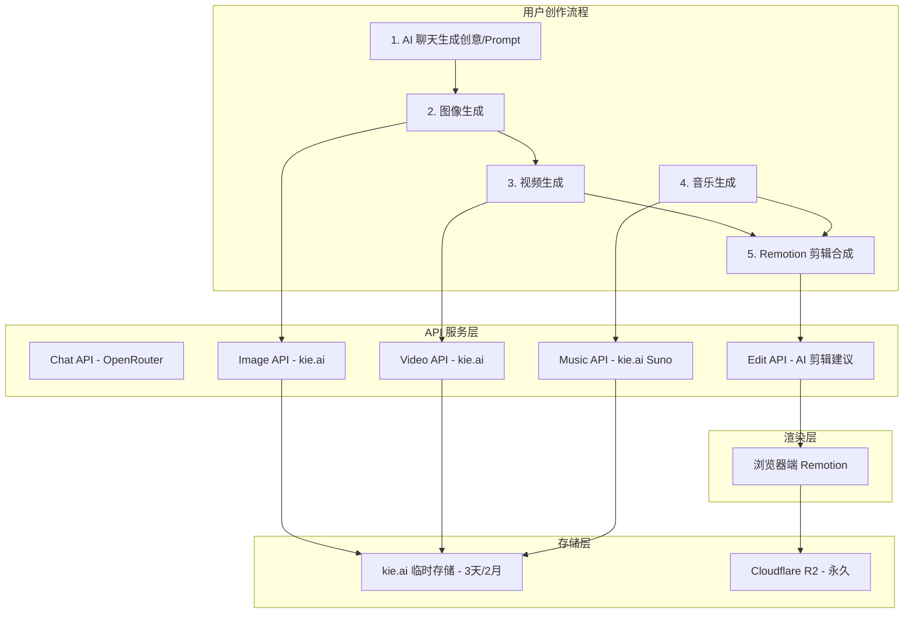
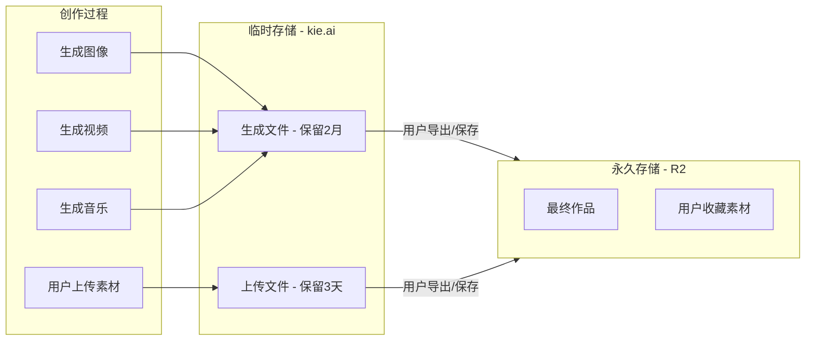

# Nano Banana Video - 一站式 AI 创作平台开发计划

## 一、产品架构总览



## 二、核心功能模块

| 模块 | 功能 | 技术方案 | 模型/服务 |

|------|------|----------|-----------|

| AI 聊天 | 创意构思、Prompt 优化 | OpenRouter + ai-sdk | GPT-4o, Claude, DeepSeek |

| 图像生成 | 文生图、图改图 | kie.ai API | Nano Banana, MJ, Flux, GPT-4o Image |

| 视频生成 | 文生视频、图生视频 | kie.ai API | Sora 2, Veo 3.1 |

| 音乐生成 | 文生音乐、歌词生成 | kie.ai Suno API | Suno V3.5/V4/V4.5/V5 |

| 视频剪辑 | 时间线编辑、动画、分层 | Remotion (浏览器) | @remotion/player |

| AI 剪辑助手 | 根据描述生成剪辑配置 | OpenRouter | JSON 配置生成 |

## 三、文件存储策略



## 四、开发任务分解

### Phase 1: kie.ai 基础设施 (核心)

**1.1 类型定义** - [`lib/kie/types.ts`](lib/kie/types.ts)

- 图像 API 类型 (Nano Banana, MJ, Flux, GPT-4o Image)
- 视频 API 类型 (Sora 2, Veo 3.1)
- 音乐 API 类型 (Suno)
- 文件上传 API 类型
- 通用响应类型

**1.2 统一客户端** - [`lib/kie/client.ts`](lib/kie/client.ts)

- 图像生成方法：`generateNanoBanana()`, `generateMidjourney()`, `generateFluxKontext()`, `generate4oImage()`
- 视频生成方法：`generateSora2Video()`, `generateVeo3Video()`
- 音乐生成方法：`generateSunoMusic()`, `extendSunoMusic()`, `generateLyrics()`
- 状态查询方法：`getTaskStatus()`, `waitForCompletion()`
- 文件上传方法：`uploadFileFromUrl()`, `uploadFileBase64()`

**1.3 模型配置** - [`config/models.ts`](config/models.ts)

```typescript
// 新增配置
export const KIE_IMAGE_MODELS = [...]; // Nano Banana, MJ, Flux, GPT-4o
export const KIE_VIDEO_MODELS = [...]; // Sora 2, Veo 3.1
export const KIE_MUSIC_MODELS = [...]; // Suno V3.5-V5
```

### Phase 2: API 路由层

**2.1 图像 API** - `app/api/kie/image/route.ts`

- POST: 创建图像生成任务
- 支持所有 4 个图像模型
- 集成积分扣除

**2.2 视频 API** - `app/api/kie/video/route.ts`

- POST: 创建视频生成任务
- Sora 2: text-to-video, image-to-video
- Veo 3.1: text-to-video, 首帧/首尾帧模式

**2.3 音乐 API** - `app/api/kie/music/route.ts`

- POST /generate: 生成音乐
- POST /extend: 延长音乐
- POST /lyrics: 生成歌词

**2.4 状态与文件 API**

- `app/api/kie/status/route.ts` - 任务状态查询
- `app/api/kie/upload/route.ts` - 文件上传到 kie.ai
- `app/api/kie/save-to-r2/route.ts` - 保存到 R2 永久存储

### Phase 3: Remotion 剪辑模块

**3.1 Remotion 基础设置**

- 安装 `@remotion/player`, `@remotion/media-utils`
- 创建 `lib/remotion/` 目录

**3.2 剪辑配置类型** - `lib/remotion/types.ts`

```typescript
interface EditProject {
  timeline: TimelineTrack[];
  duration: number;
  fps: number;
  resolution: { width: number; height: number };
}

interface TimelineTrack {
  id: string;
  type: 'video' | 'image' | 'audio' | 'text';
  src: string;
  startTime: number;
  duration: number;
  transitions?: Transition[];
  effects?: Effect[];
}
```

**3.3 AI 剪辑助手 API** - `app/api/ai/edit-suggest/route.ts`

- 用户描述剪辑需求
- AI 生成 `EditProject` JSON 配置
- 示例 Prompt: "把这3个视频片段用淡入淡出连接，加上背景音乐"

**3.4 Remotion 组件**

- `components/remotion/VideoComposition.tsx` - 主合成组件
- `components/remotion/TimelineEditor.tsx` - 时间线编辑器 UI
- `components/remotion/TrackItem.tsx` - 轨道项组件
- `components/remotion/PreviewPlayer.tsx` - 预览播放器
- `components/remotion/ExportDialog.tsx` - 导出对话框

### Phase 4: 前端页面

**4.1 一体化工作流页面** - `app/[locale]/(protected)/dashboard/studio/page.tsx`

- 四步创作流程：Prompt → 图像 → 视频/音乐 → 剪辑
- 素材库面板（显示已生成的内容）
- 拖拽素材到时间线

**4.2 独立功能页面**

- `dashboard/chat/page.tsx` - AI 创意助手
- `dashboard/image/page.tsx` - 图像生成
- `dashboard/video/page.tsx` - 视频生成
- `dashboard/music/page.tsx` - 音乐生成
- `dashboard/editor/page.tsx` - 剪辑工作台

**4.3 通用组件**

- `components/kie/TaskProgress.tsx` - 任务进度显示
- `components/kie/AssetLibrary.tsx` - 素材库组件
- `components/kie/ModelSelector.tsx` - 模型选择器

### Phase 5: 产品化

**5.1 品牌配置**

- 更新 `config/site.ts` - 网站名称、描述
- 更新 Logo/Favicon/OG 图片
- 更新首页 Hero、Features、FAQ

**5.2 积分定价建议**

| 操作 | 建议积分消耗 |

|------|-------------|

| AI 聊天 | 1 积分/次 |

| 图像生成 (Nano Banana) | 5 积分/张 |

| 图像生成 (Midjourney) | 15 积分/张 |

| 图像生成 (Flux/GPT-4o) | 10 积分/张 |

| 视频生成 (Sora 2) | 100 积分/个 |

| 视频生成 (Veo 3.1) | 80 积分/个 |

| 音乐生成 (Suno) | 20 积分/首 |

| 视频导出 | 30 积分/次 |

**5.3 导航菜单更新**

- 更新 `DashboardSidebar.tsx` 添加新菜单项

## 五、技术栈确认

| 类别 | 技术 |

|------|------|

| 框架 | Next.js 14 (App Router) |

| 语言模型 | OpenRouter (@openrouter/ai-sdk-provider) |

| 图像/视频/音乐 | kie.ai API |

| 视频剪辑 | Remotion (浏览器端) |

| 临时存储 | kie.ai 文件服务 |

| 永久存储 | Cloudflare R2 |

| 支付 | Stripe / Creem (已有) |

| 认证 | Better Auth (已有) |

## 六、预估工作量

| 阶段 | 内容 | 预估时间 |

|------|------|----------|

| Phase 1 | kie.ai 基础设施 | 3-4 小时 |

| Phase 2 | API 路由层 | 3-4 小时 |

| Phase 3 | Remotion 剪辑模块 | 6-8 小时 |

| Phase 4 | 前端页面 | 5-6 小时 |

| Phase 5 | 产品化 | 2-3 小时 |

**总计约 19-25 小时开发时间**

## 七、风险与注意事项

1. **浏览器渲染性能**：Remotion 浏览器渲染对长视频/高分辨率有限制，建议限制单次导出 ≤2分钟、≤1080p
2. **kie.ai 临时存储**：需在 UI 中提示用户及时保存重要素材到 R2
3. **积分消耗**：视频/音乐生成成本较高，需合理定价
4. **任务轮询**：视频生成耗时较长（可达 5-10 分钟），需实现可靠的状态轮询和超时处理