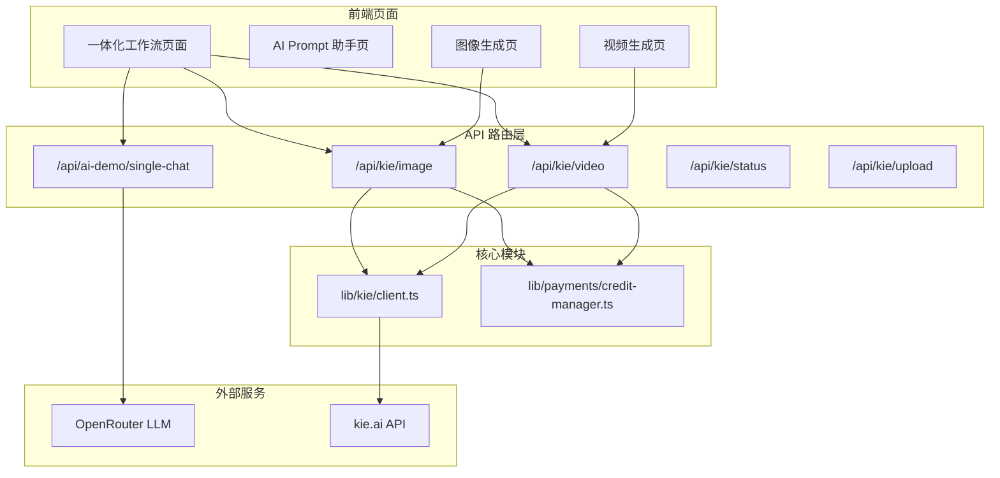
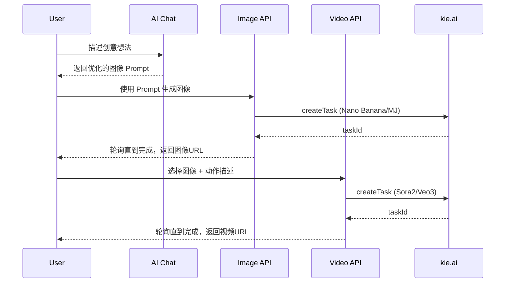

# Nano Banana Video 网站开发计划

## 一、架构概览

## 二、开发任务

### Phase 1: kie.ai 基础设施 (核心)

1. **创建 kie.ai 客户端**

   - [`lib/kie/types.ts`](lib/kie/types.ts) - API 请求/响应类型定义
   - [`lib/kie/client.ts`](lib/kie/client.ts) - 统一客户端，封装所有 kie.ai API 调用
   - 支持：任务创建、状态轮询、文件上传

2. **更新模型配置**

   - [`config/models.ts`](config/models.ts) - 添加 kie.ai 模型定义
     - 图像：Nano Banana、Midjourney、Flux Kontext、GPT-4o Image
     - 视频：Sora 2、Veo 3.1

3. **环境变量**

   - 添加 `KIE_API_KEY` 到 `.env.local`

### Phase 2: API 路由开发

4. **图像生成 API**

   - `app/api/kie/image/route.ts` - 统一图像生成入口
   - 支持 text-to-image 和 image-to-image
   - 集成积分扣除逻辑

5. **视频生成 API**

   - `app/api/kie/video/route.ts` - 统一视频生成入口
   - 支持 Sora 2 和 Veo 3.1
   - Veo 3.1 支持首尾帧模式

6. **状态查询 API**

   - `app/api/kie/status/route.ts` - 任务状态轮询
   - `app/api/kie/upload/route.ts` - 图片上传到 kie.ai

### Phase 3: 前端组件开发

7. **一体化工作流页面**

   - `app/[locale]/(protected)/dashboard/workflow/page.tsx`
   - 三步向导：Prompt生成 → 图像生成 → 视频生成
   - 每步结果可传递到下一步

8. **独立功能组件**

   - `components/kie/PromptGenerator.tsx` - AI Prompt 生成器
   - `components/kie/ImageGenerator.tsx` - 图像生成组件（支持多模型）
   - `components/kie/VideoGenerator.tsx` - 视频生成组件
   - `components/kie/TaskStatus.tsx` - 任务状态显示/轮询

9. **独立功能页面**

   - `app/[locale]/(protected)/dashboard/image-gen/page.tsx`
   - `app/[locale]/(protected)/dashboard/video-gen/page.tsx`

### Phase 4: 产品化配置

10. **品牌与站点配置**

    - [`config/site.ts`](config/site.ts) - 更新网站名称为 "Nano Banana Video"
    - 更新 Logo、Favicon、OG 图片

11. **积分定价**

    - 在 Dashboard `/dashboard/prices` 配置各操作积分消耗
    - 建议：聊天 1积分/次，图像 5-20积分/张，视频 50-200积分/个

12. **首页和导航**

    - 更新首页 Hero/Features 描述产品功能
    - 更新侧边栏导航菜单

## 三、关键模型配置参考

| 模型 | 类型 | 端点 | 特殊参数 |

|------|------|------|----------|

| Nano Banana | 文生图 | `/jobs/createTask` | image_size, output_format |

| Midjourney | 文生图 | `/mj/generate` | version, speed, aspectRatio |

| Flux Kontext | 文生图 | `/flux/kontext/generate` | model (pro/max), aspectRatio |

| GPT-4o Image | 文生图 | `/gpt4o-image/generate` | size, nVariants |

| Sora 2 | 图生视频 | `/jobs/createTask` | aspect_ratio, n_frames (10/15) |

| Veo 3.1 | 图生视频 | `/veo/generate` | generationType, aspectRatio |

## 四、工作流数据流

## 五、预估工作量

| 阶段 | 任务 | 预估时间 |

|------|------|----------|

| Phase 1 | kie.ai 基础设施 | 2-3 小时 |

| Phase 2 | API 路由开发 | 2-3 小时 |

| Phase 3 | 前端组件开发 | 4-5 小时 |

| Phase 4 | 产品化配置 | 1-2 小时 |

**总计约 10-13 小时开发时间**